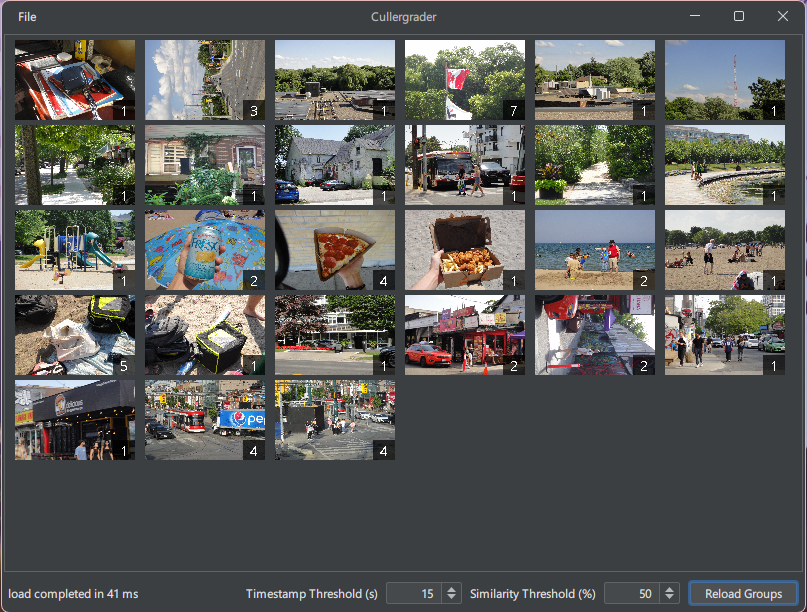
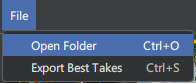
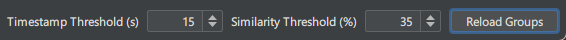
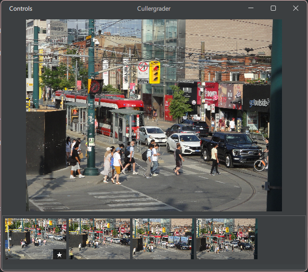
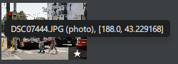
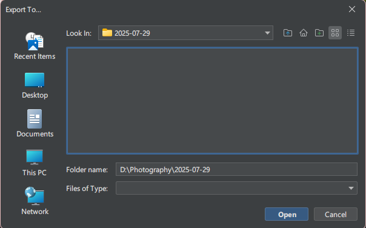

# Cullergrader
**Cullergrader** is a simple Java GUI made for photographers that groups and exports images based on [**perceptual similarity**](https://en.wikipedia.org/wiki/Perceptual_hashing) (and timestamps), allowing users to select the best shots from each set of similar, consecutively taken photos.

Like many photographers, I have the habit of taking the same shot multiple times and selecting the best one to keep. However, when going through thousands of photos, this process of culling images is time-consuming, and tools such as [**Czkawka**](https://github.com/qarmin/czkawka) (a large inspiration for this project) can detect a few _very similar_ images, but don't group _somewhat similar_ bursts.

Cullergrader is named for being a tool that culls and grades* photos. Please note that it doesn't actually _colour grade_ photos.

<sub>* grading photos has yet to be implemented...</sub>

<div style="display: flex; justify-content: center; align-items: center; gap: 20px;">
    
    
</div>
<p align="center">For example: Cullergrader would mark these two images as "similar" (at similarity threshold >= 37%)</p>

## Table of Contents
1. [Features](#features)
2. [Installation](#installation)
3. [How to Use](#how-to-use)
   1. [Open a folder of images](#1-open-a-folder-of-images)
   2. [Calibrate grouping settings](#2-calibrate-grouping-settings)
   3. [View photos and select best takes](#3-view-photos-and-select-best-takes)
   4. [Export your best takes](#4-export-your-best-takes)
4. [Config](#config)

## Features
- 100% free and open-source!
- Configurable options for calibrating your perceptual hash
    - Hash similarity
    - Timestamp difference
- Exports the best takes to any folder on your computer
- Runs on Windows, Mac, Linux, and anything else that supports Java GUIs
- Blazingly-fast thanks to configurable multithreading support
- Caches images -- future scans should be incredibly fast!
- Extra information about images availible on hover
- Runs completely offline, and never connects to the internet
- Logs information to .txt files
- Light/Dark themes
- Configurable:
    - Multithreading
    - Hashing settings
    - Cache options
    - Grouping settings
    - Dark theme
      



## Installation
Cullergrader requires a Java 8 JRE or newer to run, a prebuilt executable .jar with all required libraries bundled is available for download at [github.com/PenguinPush/cullergrader/releases](https://github.com/PenguinPush/cullergrader/releases). Extract the .zip to any folder and run the .jar to begin using Cullergrader. If you want to view logs in console, please use `run.bat` or `run.sh` depending on your operating system; **using console is highly recommended for large batches of images (or on slow drives), as there is no other way to monitor slow hashing progress!**

Compiling from source code can be done with:
```
mvn clean install
```

## How to Use
### 1. Open a folder of images
Folders can be opened from `File > Open Folder` or with `Ctrl + O`. The first time images are computed, it may take a few minutes (but often less) to hash the images, depending on image count and disk speed. Hashes are cached for future use in `cache.json`, so as long as this file stays intact, future computations of the same images will be nearly instant.



### 2. Calibrate grouping settings
Although the default settings are designed to work fine out of the box, depending on many factors in your photo, and your style of photography, manual calibration is often recommended. By adjusting the timestamp and similarity thresholds and hitting `Reload Groups`, you can adjust how your images are grouped until the grouping behaves as expected.
- `Timestamp Threshold` is the amount of seconds between two photos before it counts it as no longer a part of the same photo group, and creates a new group
- `Similarity Threshold` is the percentage of similarity between the hash of two photos. A higher threshold means more tolerance for less similar photos to be in the same group.



### 3. View photos and select best takes
By clicking on a photo, users can access the `Photo Viewer`, bringing up all individual photos in a group, with the best take marked by a star (which by default is the first image in group). By navigating using either mouse or `arrow keys` (left and right to move between photos, up and down to move between groups) to a photo, they can use the `spacebar` or `Controls > Set Best Take` to change a photo to the best take. 



**Tip:** by hovering on a photo in the photo viewer, you can view its name, seconds between the last photo, and similarity % to the last photo. Use this information to help you calibrate the grouper.


### 4. Export your best takes
Best takes can be exported to a folder using `File > Export Best Takes` or with `Ctrl + S`. After choosing an export folder, the selected best takes will begin copying to that folder!



## Config
Default config:
```json
{
    "DARK_THEME": true,
    "CACHE_FILE": "hashes.json",
    "LOG_DIRECTORY": "logs",
    "DEFAULT_FOLDER_PATH": "",
    "HASHING_ENABLED": true,
    "EXECUTOR_TIMEOUT_MINUTES": 60,
    "MAX_THREADS_RATIO": 2,
    "HASHED_WIDTH": 8,
    "HASHED_HEIGHT": 8,
    "TIME_THRESHOLD_SECONDS": 15,
    "SIMILARITY_THRESHOLD_PERCENT": 45
}
```

| Setting                        | Description                                                                                                                                                                                                                                | Variable Type |
|--------------------------------|--------------------------------------------------------------------------------------------------------------------------------------------------------------------------------------------------------------------------------------------|---------------|
| `DARK_THEME`                   | Toggles the dark and light FlatLaf themes. On by default (obviously)                                                                                                                                                                       | `boolean`     |
| `CACHE_FILE`                   | The name of the *file* used to store hash caches. Passed as a pathname in a File constructor                                                                                                                                               | `String`      |
| `LOG_DIRECTORY`                | The name of the *folder* used to store logs. Passed as a pathname in a File constructor                                                                                                                                                    | `String`      |
| `DEFAULT_FOLDER_PATH`          | The default folder opened when importing images. Passed as a pathname in a File constructor. When empty, uses the systems `user.home` property                                                                                             | `String`      |
| `HASHING_ENABLED`              | Whether or not hashing is used in grouping photos                                                                                                                                                                                          | `boolean`     |
| `EXECUTOR_TIMEOUT_MINUTES`     | The amount of time, in minutes, before the hash manager times out and stops hashing photos                                                                                                                                                 | `int`         |
| `MAX_THREADS_RATIO`            | The fraction of CPU threads the hasher is allowed to multithread. 2 means half your threads, 3 means a third, etc.                                                                                                                         | `int`         |
| `HASHED_WIDTH`                 | The width that images are computed at before hashing, higher values mean more accurate similarity checks at the cost of performance                                                                                                        | `int`         |
| `HASHED_HEIGHT`                | The height that images are computed at before hashing, higher values mean more accurate similarity checks at the cost of performance                                                                                                       | `int`         |
| `TIME_THRESHOLD_SECONDS`       | The default amount of seconds between photos (from the timestamp) before they're counted as a new group. Editable in-app, but will not change the default stored here                                                                      | `float`       |
| `SIMILARITY_THRESHOLD_PERCENT` | The default similarity between two photo hashes before they're counted as a new group. Higher values means more lenience in image similarity (larger groups, less in number). Editable in-app, but will not change the default stored here | `float`       |

Note: More config options are technically functional, such as `PLACEHOLDER_THUMBNAIL_PATH`, `KEYBIND_SET_BESTTAKE`, or `GRIDMEDIA_LABEL_TEXT_COLOR`, but are not documented here and aren't editagble by default due to their configurability not significantly impacting program function. Users are free to explore the source code and add these into `config.json` themselves, and they should work as intended. 
